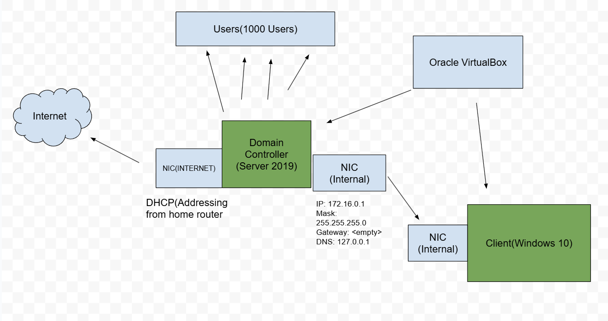

# Active-Directory-Home-Lab
- Set up Active Directory (AD) on a Windows Server VM to create a domain, manage users, and enable centralized authentication for multiple virtual machines!  
- Use Group Policy Management (GPOs) to enforce security settings, software installations, and user restrictions across all connected devices in the domain!
## Environments
- [Virtual Box](https://www.virtualbox.org/wiki/Downloads)
- [Virtual Box Extension Pack](https://www.virtualbox.org/wiki/Downloads)
- [Windows 10 ISO](https://www.microsoft.com/en-us/software-download/windows10)
- [Server 2019 ISO](https://www.microsoft.com/en-us/evalcenter/download-windows-server-2019)
## High Level Overview ##
We will  be using 2 VMs to simulate an Active Directory environment.

### First Machine ###
**Windows Server 2019 (Domain Controller - DC)**  
Purpose: Acts as the Domain Controller (DC) for managing users, authentication, and security policies.  
Roles Installed:  
Active Directory Domain Services (AD DS)  
DNS Server (for name resolution)  
DHCP Server (assigns IPs to clients)  
Network Configuration:  
NIC 1 (Internet): Gets an IP from the home router (via DHCP).  
NIC 2 (Internal Network):  
IP Address: 172.16.0.1  
Subnet Mask: 255.255.255.0  
Gateway: <empty>  
DNS: 127.0.0.1 (self-referencing for AD)  
### Second Machine ###
**Windows 10 Client (Domain-Joined Workstation)**    
Purpose: Simulates a domain-joined client to test authentication, Group Policy Objects (GPOs), and domain settings.  
Configuration:  
Installed from a Windows 10 ISO.  
Joins the Active Directory domain (mydomain.com).  
Network Configuration:  
NIC (Internal Network Only)  
IP Assignment: Receives IP dynamically via DHCP from the Domain Controller (DC).  
## Setup ##
### Creating Domain Controller ###
1. Set up Domain Controller Virtual Machine using Virtual Box
2. In Settings, Add an Additional Network(Internal Network)(This is our internal Server), and in "Advanced" set "Shared Clipboard" and "Drag'n'Drop" to "Bidirectional"
3. Boot up First VM using the Windows Server 2019 ISO
4. Set up the Server 2019 ISO, use Desktop Experience, otherwise it will just be a command line
5. To pass ctrl-alt-del because It's a virtual machine, do "insert" and "insert ctrl-alt-del
#### Setting up Internal Network ####
1. Open Network Adapater 
2. Identify Internal Network and Wifi that connects to the outer world(usually the world wifi will start with a 10.xxx)
3. Note: IPv4 with 169.254.41.101 will be internal network
4. Rename PC TO "DC" For Clarity Purposes
5. Set IP of DC to 172.16.0.1
6. Set Subnet Mask to 255.255.255.0
7. Leave Default Gateway Empty
8. Set Preferred DNS Server 127.0.0.1
#### Setting Up Active Directory and Domain Name ####
1. In Windows Server Manager, add roles and features
2. Press next, and when the checkbox pops up, choose to add Active Directory Domain Services
3. Proceed and Install, may take a minute
4. In top Right, click flag and promote to Domain Controller
5. Select "Add a New Forest"
6. Specify Domain Name(Whatever you would like it to be I named it "mydomain.com")
7. Input password unselect uncheck "Create DNS Delegation" in DNS options
8. Keep proceeding "next" until you can click "Install"
9. Once finished installing, it will log you out and restart
#### Configuring Admin User ####
1. Log Back in, it should say your domain name when you sign in
2. Open Start menu -> "Windows Administrative Tools" -> "Active Directory Users and Computers"
3. Create an Organizational Unit named "Admins"
4. Create a new User with you name in "Admins"
5. Right your user and go to "Properties" -> "Member of" -> "add"
6. Inside the "Enter the Object Names to Select", type in "Domain Admins", then "Check Names" and click "Okay"
7. Let's user our new Domain Admin: Sign out of Windows
8. Instead of logging into Normal user, select "Other User"
9. Sign in using the credentials you specified earlier for your user
#### Installing RAS/NAT ####
1. Our purpose for installing this is that we can use an Internet client to connect to our Windows 10 Device and it would still be considered within the Internal Network of our server.
2. In Server Manager, "Add Roles and Features", Go until you can select "Remote Access", Select it and proceed
3. In "Role Services," Check "Routing" and install it
4. Proceed to the end and finish installation
5. Go to "tools" and go to "Routing and Remote Access
6. Go to DC(Local) and Configure
6. Select "NAT"
7. In "NAT Internet Configuration," select the Wi-fi(Do not select the Internal Server)
8. Next and then Finish
9. RAS/NAT is now installed
### Setting up DHCP Server ####
1. Allows our Window 10 Clients to get an IP Address that allows them to browse the internet
2. In Server Manager, "Add Roles and Features", Add the "DHCP" Feature
3. Finish and Install
4. Go to "Tools," then go to "DHCP"
5. Congigure Ipv4, right click on it and click "New Scope"
6. Our new Scope name will be the range of IP Adresses so name it "172.16.0.100-200"
7. Set Start IP address from 172.16.0.100 to 172.16.0.200
8. Give mask a length of 24
9. Proceed with default settings until Router(Default Gateway)
10. Add IP Address of DC(172.16.0.1)
11. In Domain and DNS Servers, add the 172.16.0.1 and select it and proceed
12. Skip Wins Server
13. Authorize Domain by righclicking it in DHCP Wizard and Refresh IPv4
14. If done correctly, should see green check marks next to IPv4 and IPv6
#### Using Powershell Script to create multiple users ####
1. Configure Server, and turn off IE "Enhanced Security Configuration"(This allows us to browse internet on Admin and Users)
2. Drag and drop the zip file named "UserCreationScript.zip" in this repository onto the VirtualBox
3. On List of Names, add your Name to the Top
4. Run Powershell ISE as Administrator
5. Open the Powershell Script "1_CREATE_USERS"
6. In Powershell ISE type the command: Set-ExecutionPolicy Unrestricted
7. Use Powershell to change directory into the Folder containing the script
8. Run the Script
9. Verify Users have been created under _USERS Organizational Unit in Active Directory
10. Users created with the Script will all have password:Password1
#### Creating Windows 10 Client ####
1. Go to VirtualBox, create a new VM, call it CLIENT1
2. Use Windows 10 64 bit
2. In Settings -> Network, switch NAT to Internal Network
3. Open Client VM and mount Windows10 ISO
4. Make sure to Install Windows 10 Pro, do NOT install HOME
5. Ensure Everything is working with ipconfig and confirming using:  
```cmd
ping google.com
ipconfig
```
6. Confirm that there is a default gateway and that the Client ping Google
7. Join the domain in About -> Rename this PC(Advanced) ->
8. Change name to appropriate and join domain using your domain name
9. Join the Domain using the USER account you created where your username is "first initial + last name" and the password is "Password1"
10. In the DHCP, we can go to Address Leases and see a Lease has been given to our Windows10Client
## Finished! ##
You now have access to over 1000 users and can log in to each.  
Feel free to play around however you'd like, practice anything you'd like to including creating new users, resetting paswords, assigning permissions, applying group policies, etc..
